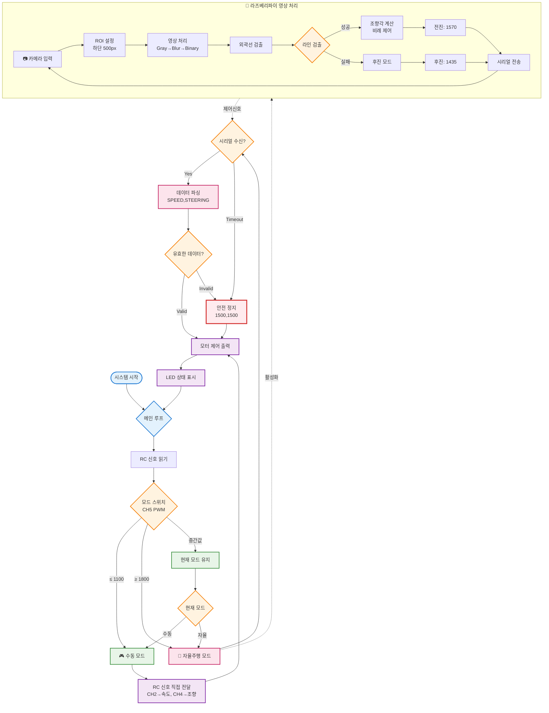

# 🚗 자율주행 RC카 시스템

## 📋 프로젝트 개요

### 목표
라즈베리파이와 아두이노를 활용한 라인 트레이싱 기반 자율주행 RC카 시스템 구현

### 주요 기능
- **실시간 영상 처리**: PiCamera를 통한 라인 검출 및 추적
- **듀얼 모드 운영**: 수동 조작과 자율주행 모드 전환
- **안정적인 통신**: 라즈베리파이 ↔ 아두이노 시리얼 통신
- **웹 모니터링**: 실시간 영상 스트리밍 및 상태 모니터링

---

## 📸 시스템 동작 및 주요 기능

### RC카 시스템


### 조종기 키 맵핑


- 조종기 직접 제어
- CH2(전후진) + CH4(조향)
- PWM 신호 → Arduino → 모터 출력

### 자율주행 모드  
- PiCamera 영상 → 라인 검출 → 조향각 계산 → 시리얼 전송 → Arduino 제어
- 라인 손실 시 자동 후진

### 웹 모니터링
- 실시간 영상 스트리밍
- ROI 영역 및 검출된 라인 시각화
- 시스템 상태 및 제어 파라미터 표시

---

## 🚀 설치 및 실행

### Raspberry Pi 설정

```bash
# 1. 시스템 업데이트
sudo apt update && sudo apt upgrade -y

# 2. 필수 패키지 설치
sudo apt install python3-picamera2 python3-opencv -y
pip3 install opencv-python flask flask-sock numpy picamera2 pyserial

# 3. 카메라 활성화
sudo raspi-config  # Interface Options → Camera → Enable

# 4. 권한 설정
sudo usermod -a -G dialout $USER
sudo usermod -a -G video $USER
```

### Arduino 업로드

```bash
# PlatformIO 사용
pio run --target upload

# 또는 Arduino IDE에서 src/main.cpp 업로드
```

### 실행

```bash
# 라인 추적 시스템 시작
python3 app.py

# 웹 브라우저에서 http://라즈베리파이IP:5000 접속
```

**사용법:**
- `s` 키: 시작 (아두이노 모드에 따라 자동 동작)
- `f` 키: 강제 시작 (아두이노 모드 무시)
- `q` 키: 종료
- `r` 키: 시리얼 재연결

---

## 📁 프로젝트 구조

```
mission_3/
├── src/
│   └── main.cpp           # Arduino 제어 코드
├── app.py                 # Raspberry Pi 메인 프로그램
├── templates/
│   └── index.html         # 웹 모니터링 인터페이스
├── platformio.ini         # PlatformIO 설정
├── RCcar.png             # RC카 하드웨어 이미지
├── controller.png         # 조종기 이미지
└── README.md             # 프로젝트 문서
```

### 📋 레포지토리 포함 소스 코드 상세

#### 🔧 Arduino 소스 코드

**`src/main.cpp` - 통합 제어 시스템** (수동 + 자율주행)
- **수동 조작 PWM 디코딩**: RC 수신기에서 CH2(전후진), CH4(조향), CH5(모드 스위치) PWM 신호 해석
- **자율주행 시리얼 통신**: 라즈베리파이로부터 속도/조향 명령을 시리얼로 수신
- **모드 자동 전환**: PWM 값 기반 히스테리시스로 수동/자율주행 모드 전환
- **PWM 출력 생성**: 50Hz 타이머 인터럽트 기반 정밀 PWM 신호 출력
- **안전 장치**: 시리얼 타임아웃 시 자동 정지, LED 상태 표시

```cpp
// 주요 기능
- RC PWM 신호 디코딩 (Pin 2, 3, 4)
- 모터/서보 PWM 출력 (Pin 6, 7)
- 시리얼 통신 프로토콜 처리
- 모드 전환 로직 (히스테리시스 적용)
- LED 방향 표시등 제어 (Pin 8, 9)
```

#### 🐍 Python 소스 코드

**`app.py` - 자율주행 이미지 처리 및 제어 시스템**
- **실시간 영상 처리**: PiCamera2 기반 라인 검출 알고리즘
- **ROI 최적화**: 화면 하단 500픽셀 영역 집중 분석으로 연산량 최적화
- **라인 추적 제어**: 비례제어 기반 조향각 계산 및 PWM 출력
- **시리얼 통신 관리**: Arduino와의 안정적 통신 및 자동 재연결
- **웹 모니터링**: Flask + WebSocket 기반 실시간 스트리밍

```python
# 주요 클래스 및 메소드
class LineFollower:
    - detect_line()         # 라인 검출 알고리즘
    - calculate_steering()  # 조향각 계산
    - autonomous_drive()    # 자율주행 메인 루프
    - send_control_signal() # Arduino 통신
    - setup_web_routes()    # 웹 인터페이스
```

#### 🌐 웹 인터페이스

**`templates/index.html` - 실시간 모니터링 UI**
- **영상 스트리밍**: WebSocket 기반 실시간 카메라 영상 표시
- **상태 모니터링**: 속도, 조향, 연결 상태, 모드 표시
- **ROI 시각화**: 관심영역 및 검출된 라인 오버레이
- **제어 파라미터**: 시스템 상태 및 성능 지표 실시간 업데이트

#### ⚙️ 설정 파일

**`platformio.ini` - PlatformIO 프로젝트 설정**
```ini
[env:uno]
platform = atmelavr
board = uno
framework = arduino
lib_deps = 
    arkhipenko/TaskScheduler
    NicoHood/PinChangeInterrupt
```

### 💡 소스 코드 특징

| 구분 | 파일 | 주요 특징 | 담당 기능 |
|------|------|-----------|----------|
| **Arduino** | `main.cpp` | 통합 제어 시스템 | 수동 PWM 디코딩 + 자율주행 시리얼 통신 |
| **Python** | `app.py` | 영상 처리 및 제어 | 라인 검출, 조향 계산, 웹 인터페이스 |
| **Web** | `index.html` | 실시간 모니터링 | 영상 스트리밍, 상태 표시 |
| **Config** | `platformio.ini` | 빌드 설정 | 라이브러리 의존성, 보드 설정 |

### 🔄 동작 모드별 소스 활용

1. **수동 주행 모드**: 
   - `main.cpp`의 RC PWM 디코딩 기능만 사용
   - CH2/CH4 신호를 직접 모터로 전달

2. **자율주행 모드**:
   - `app.py`의 영상 처리로 라인 검출
   - `main.cpp`의 시리얼 통신으로 제어 신호 수신

3. **통합 운영**:
   - 두 모드가 CH5 스위치로 실시간 전환
   - 안전장치로 타임아웃 및 오류 처리 포함

---

## ⚙️ 시스템 아키텍처

### 하드웨어 구성
```
[RadioLink AT9 송신기] 
         ↓ (무선 신호)
    [R9DS 수신기]
         ↓ (PWM)
      [Arduino Uno]
         ↕ (Serial)
   [Raspberry Pi 5]
         ↑
    [PiCamera]
```

### 사용 부품
- **제어 보드**: Raspberry Pi 5, Arduino Uno
- **카메라**: PiCamera 모듈
- **송수신기**: RadioLink AT9 + R9DS 수신기
- **구동계**: DC 모터 1개, 서보 모터 1개
- **표시등**: LED 2개 (좌/우 방향 표시)

### 핀 배치 및 연결
| 기능 | Arduino 핀 | 설명 |
|------|-----------|------|
| RC CH2 (전후진) | Pin 2 | 수동 모드 속도 제어 |
| RC CH4 (조향) | Pin 3 | 수동 모드 방향 제어 |
| MODE CH (모드 스위치) | Pin 4 | 자율/수동 모드 전환 |
| 속도 출력 | Pin 6 | DC 모터 PWM 출력 |
| 조향 출력 | Pin 7 | 서보 모터 PWM 출력 |
| 좌측 LED | Pin 8 | 좌회전 표시 |
| 우측 LED | Pin 9 | 우회전 표시 |

---

## 🔄 동작 원리 및 제어 방법

### 📊 전체 시스템 플로우차트



### 1. 모드 전환 시스템

**PWM 기반 모드 결정**:
```cpp
bool checkModeFromPWM(uint16_t pwmValue) {
    if (pwmValue >= 1800) {
        return true;   // 자율주행 모드
    } else if (pwmValue <= 1100) {
        return false;  // 수동 모드
    } else {
        return autonomousMode;  // 히스테리시스로 현재 모드 유지
    }
}
```

**특징**:
- 히스테리시스 적용으로 모드 오작동 방지
- 실시간 모드 상태 피드백
- 안전을 위한 모드 전환 시 정지 신호 전송

### 2. 이미지 처리 및 라인 검출

**처리 파이프라인**:
```
원본 이미지 → ROI 설정 → Grayscale 변환 → Gaussian Blur 
→ Binary Threshold → Morphological Operations → Contour Detection 
→ 중심점 계산 → 조향각 결정
```

**핵심 알고리즘** (`app.py:300-332`):
```python
def detect_line(self, frame):
    # 1. ROI 설정 (화면 하단 500픽셀)
    gray = cv2.cvtColor(frame, cv2.COLOR_RGB2GRAY)
    roi = gray[height-500:height, :]
    
    # 2. 노이즈 제거 및 이진화
    blurred = cv2.GaussianBlur(roi, (5, 5), 0)
    _, binary = cv2.threshold(blurred, 160, 255, cv2.THRESH_BINARY_INV)
    
    # 3. 형태학적 연산
    kernel = np.ones((3, 3), np.uint8)
    binary = cv2.morphologyEx(binary, cv2.MORPH_OPEN, kernel)
    binary = cv2.morphologyEx(binary, cv2.MORPH_CLOSE, kernel)
    
    # 4. 외곽선 검출 및 중심점 계산
    contours, _ = cv2.findContours(binary, cv2.RETR_EXTERNAL, cv2.CHAIN_APPROX_SIMPLE)
    if contours:
        largest_contour = max(contours, key=cv2.contourArea)
        if cv2.contourArea(largest_contour) > 6400:  # 면적 필터링
            M = cv2.moments(largest_contour)
            cx = int(M['m10'] / M['m00'])  # 중심 X 좌표
            return cx
```

**최적화 기법**:
- **ROI 제한**: 화면 하단 500픽셀만 처리하여 연산량 감소
- **면적 필터링**: 최소 6400px 이상 객체만 인식하여 노이즈 제거
- **형태학적 연산**: Opening + Closing으로 라인 연결성 향상

### 3. 조향 제어 알고리즘

**비례 제어 기반 조향** (`app.py:334-344`):
```python
def calculate_steering(self, line_center):
    error = self.image_center - line_center  # 중심 오차 계산
    steering_adjustment = int(error * self.steering_sensitivity)  # 비례 제어
    steering_pwm = 1500 + steering_adjustment
    return max(1000, min(2000, steering_pwm))  # PWM 범위 제한
```

**제어 파라미터**:
- 기준값: 1500 (중립)
- 전진 속도: 1570
- 후진 속도: 1435 (라인 미검출 시)
- 조향 민감도: 1.05

---

## 🌐 통신 프로토콜

### 라즈베리파이 ↔ 아두이노 시리얼 통신

**통신 설정**:
- 포트: 자동 검색 (/dev/ttyUSB*, /dev/ttyACM*)
- 보드레이트: 9600 bps
- 타임아웃: 1초

**프로토콜 형식**:
```
[Raspberry Pi → Arduino]
형식: "SPEED,STEERING\n"
예시: "1570,1450\n"

SPEED: 1000-2000 (1500=정지, 1570+=전진, 1435-=후진)
STEERING: 1000-2000 (1500=직진, 1600+=우회전, 1400-=좌회전)
```

**안정성 보장 메커니즘**:
- 자동 포트 검색 및 연결
- 타임아웃 기반 안전 정지
- 연결 오류 감지 및 자동 재연결
- 시리얼 버퍼 관리

### 웹소켓 기반 실시간 모니터링

**데이터 스트리밍** (`app.py:274-298`):
```python
data = {
    'image': jpg_b64,              # Base64 인코딩 영상
    'steering': self.current_steering,
    'speed': self.current_speed,
    'running': self.running,
    'serial_connected': self.serial_connected,
    'autonomous_mode': self.autonomous_mode
}
```

---

## 🎯 제어 로직 상세

### 자율주행 메인 루프 (`app.py:407-478`)

```python
def autonomous_drive(self):
    while self.running:
        # 모드 확인 및 라인 검출
        should_track_line = (self.manual_override or 
                           (self.autonomous_mode and self.serial_connected))
        
        if should_track_line:
            frame = self.picam2.capture_array()
            line_center = self.detect_line(frame)
            steering_pwm = self.calculate_steering(line_center)
            
            if line_center is not None:
                speed_pwm = self.base_speed      # 정상 추적: 전진
            else:
                speed_pwm = self.backword_speed  # 라인 손실: 후진
            
            self.send_control_signal(speed_pwm, steering_pwm)
```

### Fail-Safe 메커니즘

1. **라인 손실 시**: 자동 후진하여 라인 재검출 시도
2. **통신 타임아웃**: 1초 내 신호 없으면 정지
3. **모드 전환**: 안전을 위한 일시 정지 후 모드 변경
4. **하드웨어 인터럽트**: 50Hz 타이머로 정확한 PWM 생성

---

## 👥 팀 구성 및 역할

| 팀원 | 주요 담당 영역 | 구체적 기여 내용 |
|------|---------------|-----------------|
| **변하연** | **하드웨어 설계 & 제어 시스템** | • RC 수신기 PWM 신호 해석 및 처리 구현<br>• 아두이노 기반 모터/서보 제어 시스템 개발<br>• 하드웨어 연결도 설계 및 핀 배치<br>• 수동/자율 모드 전환 하드웨어 로직 구현<br>• LED 표시등 제어 시스템 |
| **고광채** | **소프트웨어 알고리즘 & 통신** | • 영상 처리 기반 라인 검출 알고리즘 개발<br>• 라즈베리파이-아두이노 시리얼 통신 프로토콜 설계<br>• 자율주행 제어 알고리즘 구현<br>• 웹 기반 실시간 모니터링 시스템 개발<br>• 시스템 통합 및 안정성 최적화 |

### 🤝 공동 작업 영역
- 시스템 통합 테스트 및 디버깅
- 주행 성능 튜닝 및 파라미터 최적화
- 문제 해결 및 개선 사항 도출

---

## 🔧 문제 해결 및 개선 사항

### 해결된 주요 문제

1. **PWM 핀 충돌 해결**
   - 문제: Arduino Uno 0,1번 핀 사용 시 USB 통신 충돌
   - 해결: PWM 출력을 6,7번 핀으로 재배정

2. **급커브 라인 손실 대응**
   - 문제: 커브에서 ROI 벗어난 라인 미검출
   - 해결: 라인 손실 시 자동 후진 로직 구현

3. **모드 전환 노이즈 방지**
   - 문제: PWM 노이즈로 인한 모드 오작동
   - 해결: 히스테리시스 적용으로 안정성 확보


---